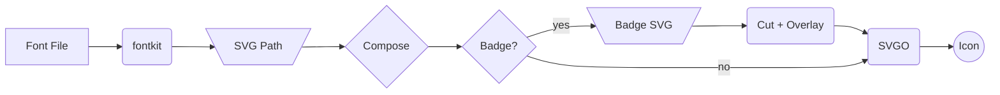

# Letter Icon Composer

A browser-based tool and CLI for generating IntelliJ-style letter-on-shape SVG icons.

**https://davidseptimus.github.io/letter-icon-composer/**

## Background

IntelliJ language plugins require 16x16 SVG icons for PSI elements, file types, structure view nodes, and completion items. JetBrains expUI represents these as single- or multi-letter glyphs centered on geometric shapes (circles, rounded rectangles, diamonds, shields, etc.) using a defined color palette with separate light and dark theme variants.

Producing these icons manually in a vector graphics editor means converting text to paths, sizing and centering the glyph on a background shape, applying the correct theme colors, exporting, and repeating the whole process for the dark variant. This is manageable for a few icons but becomes tedious when a plugin needs dozens across multiple element types.

This tool generates both theme variants from a letter, shape, and color selection.

## Intended Audience

IntelliJ plugin developers building custom language support who need icons consistent with JetBrains expUI conventions.

## How It Works

1. [fontkit](https://github.com/foliojs/fontkit) parses a font file and converts glyphs into SVG path data
2. The letter path is composited onto the selected background shape with the appropriate theme colors
3. If a badge SVG is provided, [Paper.js](http://paperjs.org) builds the badge silhouette — strokes are expanded into filled outlines via [paperjs-offset](https://github.com/glenzli/paperjs-offset) so the full visual extent is captured — then the silhouette is offset by a configurable gap and boolean-subtracted from each background shape; the badge is overlaid in the cleared area (clipPath fallback when Paper.js is unavailable)
4. [SVGO](https://svgo.dev) optimizes the final SVG using the same configuration as the [Sketch SVGO Compressor plugin](https://www.sketchapp.com/extensions/plugins/svgo-compressor/), which is the [recommended method](https://plugins.jetbrains.com/docs/intellij/icons.html) for optimizing icons per the JetBrains platform guidelines
5. Light and dark theme variants are produced together



## Features

- **Letter Icon mode** (default): letter-on-shape icon generation with light/dark theme variants
  - 10 built-in background shapes (6 from JetBrains expUI, 4 custom): circle, rounded rect, diamond, rounded diamond, shield, dashed circle, dashed rect, hexagon, document, composite
  - Import custom SVG shapes — geometry is re-colored to match the active preset
  - 9 color presets: blue, orange, purple, red, green, amber (JetBrains official), grey, teal, pink
  - Save custom color presets from the current light/dark color values
  - Custom color overrides per theme variant
  - Font selection: Open Sans (default), Inter, Google Fonts, or local .ttf/.otf/.woff/.woff2 files
  - Fine-tuning: font size, x/y offset, stroke width, shape scale
- **Badge Composer mode**: import a complete SVG icon (no letter, no recoloring) and apply badge cutouts/overlays — outputs a single file
- Optional badge overlay: import one or more SVGs as corner badges (drag-drop, paste, or file picker) with per-badge gap, position, and scale
- Optional SVGO optimization with file size display
- Imported shapes, icons, and saved presets persist across sessions via local storage
- CLI for scripting and batch generation

## Usage

### Browser

Open `index.html` in a browser or serve the directory locally (`npx serve .`). All processing runs client-side.

### CLI

```bash
npm install

# Blue circle "N" icon
node cli.js -l N -s circle -c blue -o ./icons/

# Purple hexagon with custom filename
node cli.js -l E -s hexagon -c purple -n element -o ./icons/

# Inter font, bold
node cli.js -l R -s document -c blue --font inter --bold -o ./icons/

# Custom imported shape as background
node cli.js -l N --custom-shape my-shape.svg -c blue -o ./icons/

# Badge composer — import icon + badge overlay
node cli.js --base-icon logo.svg --badge-svg badge.svg -o ./icons/

# Output to stdout
node cli.js -l A -s shield -c green --stdout

# List available presets or shapes
node cli.js --list presets
node cli.js --list shapes
```

Run `node cli.js --help` for all options.

### Text-to-SVG (letter badges)

The `text-to-svg` subcommand converts text to SVG `<path>` elements, useful for creating letter badges that can be fed back into the main tool via `--badge-svg`.

```bash
# Generate a bold "N" letter badge
node cli.js text-to-svg -t "N" --bold -o badge.svg

# Multi-character badge with tight bounding box
node cli.js text-to-svg -t "Ab" --tight --color "#3574F0"

# Compose: letter badge on a circle icon
node cli.js text-to-svg -t "N" --bold --color "#3574F0" -o /tmp/badge.svg
node cli.js -l E -s circle -c blue --badge-svg /tmp/badge.svg -o ./icons/
```

Run `node cli.js text-to-svg --help` for all options.

## Output

In letter icon mode, each invocation produces two files:

- `<name>.svg` — light theme variant
- `<name>_dark.svg` — dark theme variant

The `_dark` suffix follows the IntelliJ convention for automatic theme-based icon resolution.

In badge composer mode (`--base-icon`), a single file is produced: `<name>.svg`.

## Acknowledgments

- [fontkit](https://github.com/foliojs/fontkit) — font parsing and glyph-to-SVG conversion
- [Paper.js](http://paperjs.org) — boolean path operations for badge cutouts
- [paperjs-offset](https://github.com/glenzli/paperjs-offset) — path offsetting and stroke expansion (the engine behind clean badge silhouette cuts)
- [SVGO](https://svgo.dev) — SVG optimization

## License

Apache 2.0. See [LICENSE](LICENSE).
